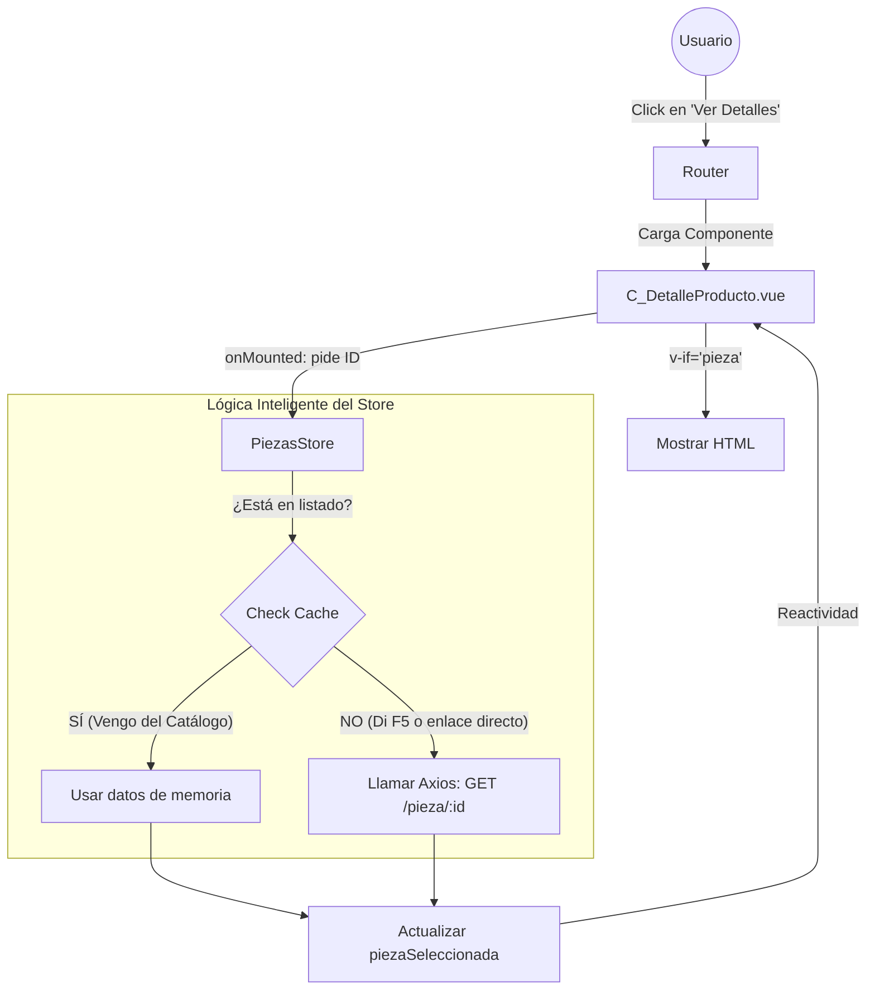

```mermaid
graph TD
    User((Usuario)) -->|Click en 'Ver Detalles'| Router
    Router -->|Carga Componente| Detalle[C_DetalleProducto.vue]
    Detalle -->|onMounted: pide ID| Store[PiezasStore]
    
    subgraph Lógica Inteligente del Store
        Store -->|¿Está en listado?| Check{Check Cache}
        Check -- SÍ (Vengo del Catálogo) --> Cache[Usar datos de memoria]
        Check -- NO (Di F5 o enlace directo) --> API[Llamar Axios: GET /pieza/:id]
    end
    
    Cache --> UpdateState[Actualizar piezaSeleccionada]
    API --> UpdateState
    UpdateState -->|Reactividad| Detalle
    Detalle -->|v-if='pieza'| Render[Mostrar HTML]

```