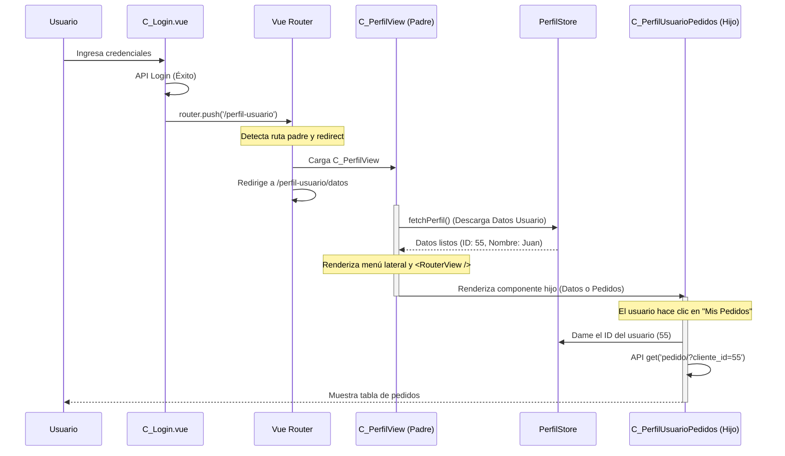

```mermaid
sequenceDiagram
    participant User as Usuario
    participant Login as C_Login.vue
    participant Router as Vue Router
    participant View as C_PerfilView (Padre)
    participant Store as PerfilStore
    participant Child as C_PerfilUsuarioPedidos (Hijo)

    User->>Login: Ingresa credenciales
    Login->>Login: API Login (Éxito)
    Login->>Router: router.push('/perfil-usuario')
    
    Note over Router: Detecta ruta padre y redirect
    Router->>View: Carga C_PerfilView
    Router->>Router: Redirige a /perfil-usuario/datos
    
    activate View
    View->>Store: fetchPerfil() (Descarga Datos Usuario)
    Store-->>View: Datos listos (ID: 55, Nombre: Juan)
    
    Note over View: Renderiza menú lateral y <RouterView />
    View->>Child: Renderiza componente hijo (Datos o Pedidos)
    deactivate View
    
    activate Child
    Note over Child: El usuario hace clic en "Mis Pedidos"
    Child->>Store: Dame el ID del usuario (55)
    Child->>Child: API get('pedido/?cliente_id=55')
    Child-->>User: Muestra tabla de pedidos
    deactivate Child

```