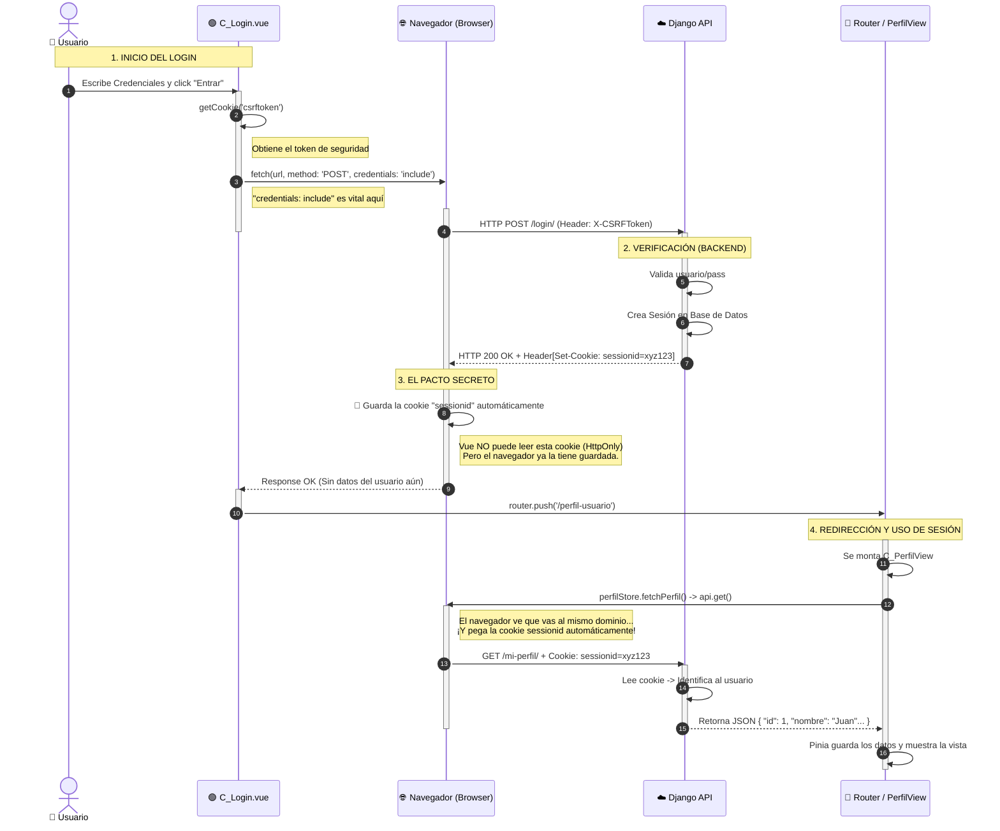

```mermaid
sequenceDiagram
    autonumber
    
    actor User as 👤 Usuario
    participant Vue as 🟢 C_Login.vue
    participant Browser as 🌐 Navegador (Browser)
    participant API as ☁️ Django API
    participant Router as 🔀 Router / PerfilView

    Note over User, Vue: 1. INICIO DEL LOGIN
    User->>Vue: Escribe Credenciales y click "Entrar"
    
    activate Vue
    Vue->>Vue: getCookie('csrftoken')
    Note right of Vue: Obtiene el token de seguridad
    
    Vue->>Browser: fetch(url, method: 'POST', credentials: 'include')
    Note right of Vue: "credentials: include" es vital aquí
    
    activate Browser
    Browser->>API: HTTP POST /login/ (Header: X-CSRFToken)
    deactivate Vue
    
    activate API
    Note over API: 2. VERIFICACIÓN (BACKEND)
    API->>API: Valida usuario/pass
    API->>API: Crea Sesión en Base de Datos
    
    API-->>Browser: HTTP 200 OK + Header[Set-Cookie: sessionid=xyz123]
    deactivate API
    
    Note over Browser: 3. EL PACTO SECRETO
    Browser->>Browser: 💾 Guarda la cookie "sessionid" automáticamente
    Note right of Browser: Vue NO puede leer esta cookie (HttpOnly)<br>Pero el navegador ya la tiene guardada.
    
    Browser-->>Vue: Response OK (Sin datos del usuario aún)
    deactivate Browser
    
    activate Vue
    Vue->>Router: router.push('/perfil-usuario')
    deactivate Vue
    
    Note over Router: 4. REDIRECCIÓN Y USO DE SESIÓN
    activate Router
    Router->>Router: Se monta C_PerfilView
    Router->>Browser: perfilStore.fetchPerfil() -> api.get()
    
    activate Browser
    Note right of Browser: El navegador ve que vas al mismo dominio...<br>¡Y pega la cookie sessionid automáticamente!
    Browser->>API: GET /mi-perfil/ + Cookie: sessionid=xyz123
    
    activate API
    API->>API: Lee cookie -> Identifica al usuario
    API-->>Router: Retorna JSON { "id": 1, "nombre": "Juan"... }
    deactivate API
    deactivate Browser
    
    Router->>Router: Pinia guarda los datos y muestra la vista
    deactivate Router

```